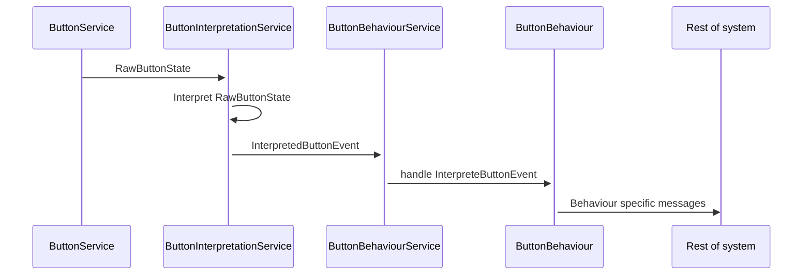

# ButtonBehaviourDemo

This is a demo project implementing a system which can monitor a number of buttons, react to presses, releases, press and hold and multi-clicks, and implement some sort of domain-specific logic based on said events.

It is implemented as a number of microservices.

ButtonService: Posts the raw state of a button (i.e. is it pushed or released)
ButtonInterpretationService: Reacts to raw button state changes, and interprets these into button events (Press, Release, PressAndHold, MultiClick)
ButtonBehaviourService: Reacts to interpreted button events and relays these to a configured ButtonBehaviour.

ButtonBehaviour is a class which handles interpreted button events and implements domain-specific logic.

The following diagram gives a visual representation of the flow of messages.

